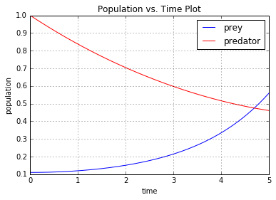

UECM3033 Assignment #3 Report
========================================================

- Prepared by: Lim Mei Kuan
- Tutorial Group: T2

--------------------------------------------------------

## Task 1 --  Gauss-Legendre formula

The reports, codes and supporting documents are to be uploaded to Github at: 

[https://github.com/Limmeikuan/UECM3033_assign3](https://github.com/Limmeikuan/UECM3033_assign3)

Explain how you implement your `task1.py` here.
In task 1, we are needed to find the Gauss-Legendre quadrature by implementing the code into self define function of def gausslegendre(f,a,b,n=20). Under this function, I find the weights, nodes by using the help of numpy.polynomial.legendre.leggauss. From here, I will be able to find the matrix of x and w which are the nodes and weights by repeating for 20 times. Then, by using the x found, use it to find t which is the substitute into the function f(x) into f(t) to find answer by adding up sum of w multiply by f(t) and multiply it by half of b-a where a and b are the integration from a to b which from the task 0 and 1.Meanwhile, t can be find by using x, which is by the equation of 0.5*(x+1)*(b-a)+a.Then we will be able to find the integration answer by using gauss legendre quadrature.      

Explain how you get the weights and nodes used in the Gauss-Legendre quadrature.
The weights and nodes can be get by importing numpy.polynomial.legendre.leggauss. 
---------------------------------------------------------

## Task 2 -- Predator-prey model

Explain how you implement your `task2.py` here, especially how to use `odeint`.
In order to generate task 2 to solve the predator-prey model,ODE system with odeint was used. First, a self-define function g was created which is to identify the equation of differentiated prey and predator equations which was given and the parameters a and b also needed to put into the function. Then, an array with initial condition was created which was when x is 0, the y will be 0.1 and 1.0 respectively. Then, the time which was 0 to 5 years were chopped into 1000 sections by using np.linspace(0,5,1000). Then the solution was counted by using the scipy.integrate.odeint of self-defined function,initial condition and the time. So in order to plot the graph of prey and predator vs time, the number of prey can be find by taking out the first column and predator by the second column. So, by the help of matplotlib.pyplot, the graph of population versus time can be created. Consequently, the graph of predator versus prey also can be created. Then, both the graphs were properly labelled. 
Then, for the second part, the initial condition was modified where the array will becme 0.11 and 1.0 while others will remain the same.
    
Put your graphs here and explain.
When the y0 is 0.1, y1 is 1.0.

When the y0 is 0.11, y1 is 1.0.

From the graphs shown above, there were just a minor changed in the ouput when there is a changed in the initial condition y0.Meanwhile,when yhe number of prey appeared to be lowest when the the number of predator is highest which indicates the inverse relationship between this two. So, when the time increase, the prey will increase while there is a decrease in predators.  

Is the system of ODE sensitive to initial condition? Explain.
No, the system of ODE is not sensitive to initial condition. If the system of ODE is sensitive, the small amount change of starting value will cause the large changes is output. So, from the graphs, we can observed that the changes of output is very minor. 
-----------------------------------

last modified: 15 April 2016
